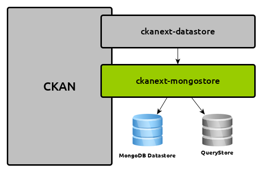

# ckanext-mongodatastore

The MongoDatastore is a datastore implementation for `CKAN <https://www.ckan.org>`_, that uses MongoDB for storing data records. One aspect of this implementation is, that it follows the `RDA Recommendations for Data Citation <https://doi.org/10.15497/RDA00016>`_. This guarantiees citability for every query that is submited to the datastore.

*As this extension provides an implementation of the* `IDatastoreBackend <https://docs.ckan.org/en/latest/maintaining/datastore.html#extending-datastore>`_, *therefore the DataStore API can be used as before.*

## Requirements
This CKAN extension is tested with CKAN 2.8.5 running on Python 2.7.

To run this plugin beside an CKAN a mongo and a postgre database is required. The mongo database is needed for storing the data records and the postgre database is used as a querystore, described in the RDA Recommendations. For both instances a connection string has to be set in the CKAN config file.

## Installation

To install ckanext-mongodatastore:

1. `Install MongoDB <https://docs.mongodb.com/manual/installation/>`_

2. If not already existing, a QueryStore database has to be created::

     sudo -u postgres createuser -S -D -R -P querystore
     sudo -u postgres createdb -O querystore querystore -E utf-8

3. Activate your CKAN virtual environment, for example::

     . /usr/lib/ckan/default/bin/activate

4. Install the ckanext-mongodatastore Python package into your virtual environment::

     pip install ckanext-mongodatastore

5. Set the ckanext-mongodatastore specific config settings the CKAN configuration file 
   (by default the config file is located at
   ``/etc/ckan/default/production.ini``).

5. Add ``mongodatastore`` to the ``ckan.plugins`` setting in your CKAN
   config file (by default the config file is located at
   ``/etc/ckan/default/production.ini``).

6. Restart CKAN. For example if you've deployed CKAN with Apache on Ubuntu::

     sudo service apache2 reload

## Config Settings
For running the MongoDb datastore two settings have to configured in your CKAN's configuration file::

    ckan.datastore.write_url = mongodb://[datastorehost]:27017
    ckan.querystore.url = [URL to your query store database]

## Development Installation

To install ckanext-mongodatastore for development, activate your CKAN virtualenv and
do::

    git clone https://github.com/fwoerister/ckanext-mongodatastore.git
    cd ckanext-mongodatastore
    python setup.py develop
    pip install -r dev-requirements.txt

## Running the Tests

To run the tests, do::

    nosetests --nologcapture --with-pylons=test.ini

To run the tests and produce a coverage report, first make sure you have
coverage installed in your virtualenv (``pip install coverage``) then run::

    nosetests --nologcapture --with-pylons=test.ini --with-coverage --cover-package=ckanext.mongodatastore --cover-inclusive --cover-erase --cover-tests

## Releasing a New Version of ckanext-mongodatastore

ckanext-mongodatastore is availabe on PyPI as https://pypi.python.org/pypi/ckanext-mongodatastore.
To publish a new version to PyPI follow these steps:

1. Update the version number in the ``setup.py`` file.
   See `PEP 440 <http://legacy.python.org/dev/peps/pep-0440/#public-version-identifiers>`_
   for how to choose version numbers.

2. Create a source distribution of the new version::

     python setup.py sdist

3. Upload the source distribution to PyPI::

     python setup.py sdist upload

4. Tag the new release of the project on GitHub with the version number from
   the ``setup.py`` file. For example if the version number in ``setup.py`` is
   0.0.2 then do::

       git tag 0.0.2
       git push --tags
